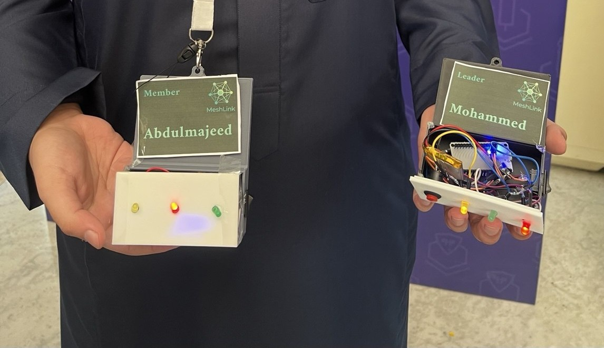
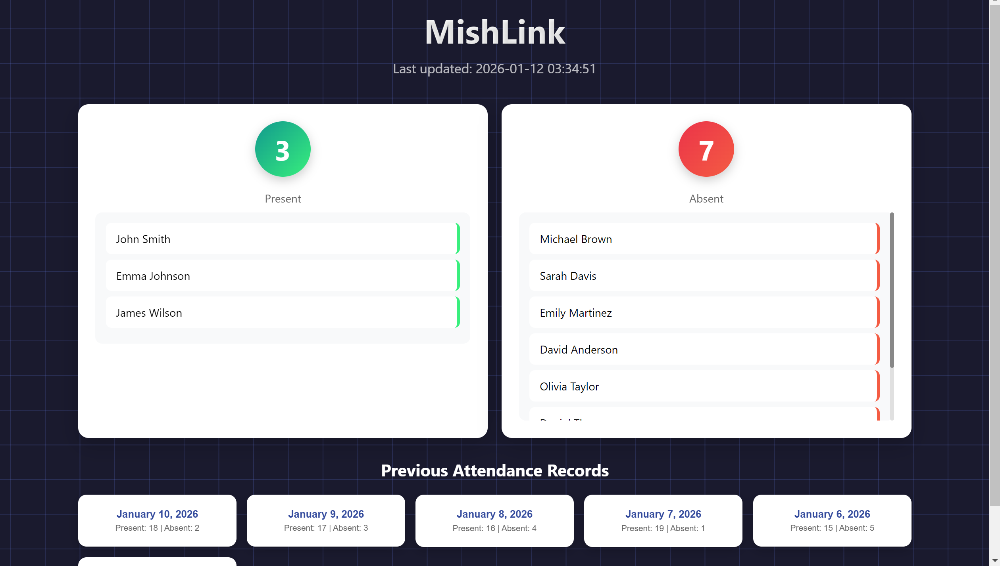
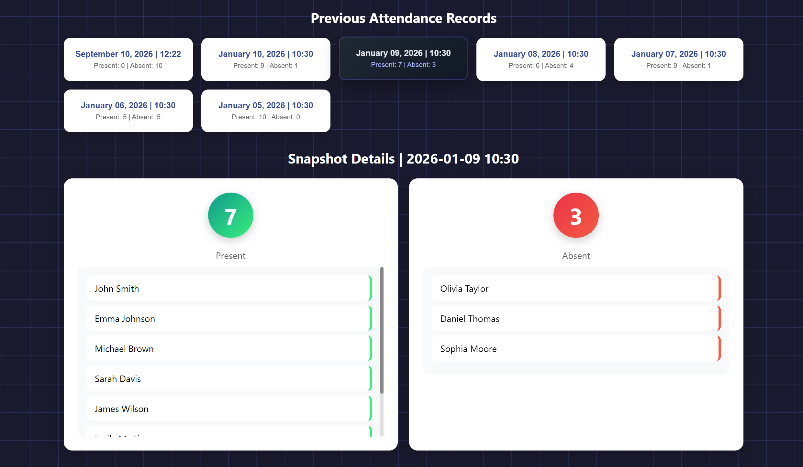

<div align="center">

# MeshLink

### Decentralized BLE-Based Roll Call & Presence Detection System

**2nd Place Winner — Protothon**

ESP32 • Bluetooth Low Energy • Laravel • Real-Time Attendance • IoT

[Source Code](https://github.com/mj0d19/MeshLink) • Live Demo Coming Soon

</div>

---

## Overview

MeshLink is a decentralized IoT-based roll call and presence detection system designed to identify whether members of a group are present without relying on a traditional centralized attendance process.

The system combines multiple ESP32 devices communicating through Bluetooth Low Energy (BLE) with a Laravel-based web platform that provides real-time attendance visualization, participant status, and historical attendance snapshots.

MeshLink was developed during **Protothon**, where the project achieved **2nd Place**.

---

## The Problem

Traditional roll call methods can become inefficient when monitoring groups in dynamic environments.

Manual attendance requires direct interaction, takes time, and provides limited visibility once the roll call is completed.

MeshLink explores a different approach:

> Can a distributed network of small devices automatically determine who is present and provide that information through a live digital platform?

---

## The Solution

MeshLink uses multiple ESP32 devices operating as **Leader** and **Participant** nodes.

Participant devices detect nearby MeshLink nodes using BLE and report their sightings to the Leader.

The Leader aggregates the collected presence information and creates a unified roll call state.

That information can then be transmitted to the MeshLink web platform, where users can monitor attendance and save historical snapshots.

---

## How It Works

```text
┌────────────────────┐
│ Participant ESP32  │
│      Node 01       │
└─────────┬──────────┘
          │
          │ BLE Scan / Sightings
          │
          ▼
┌────────────────────┐
│ Participant ESP32  │
│      Node 02       │
└─────────┬──────────┘
          │
          │ BLE Communication
          │
          ▼
┌────────────────────┐
│    Leader ESP32    │
│                    │
│ Aggregates nearby  │
│ participant data   │
└─────────┬──────────┘
          │
          │ Roll Call Data
          ▼
┌────────────────────┐
│    Laravel API     │
│                    │
│ Stores the latest  │
│ attendance state   │
└─────────┬──────────┘
          │
          ▼
┌────────────────────┐
│ MeshLink Dashboard │
│                    │
│ Present / Absent   │
│ Snapshot History   │
└────────────────────┘
```

---

## Core Features

### Decentralized Presence Detection

Participant ESP32 devices scan their surroundings for other MeshLink devices using Bluetooth Low Energy.

This allows nodes to contribute to presence detection instead of relying entirely on one central scanner.

### Leader / Participant Architecture

The system assigns different responsibilities to ESP32 nodes:

- **Participant Nodes** scan for nearby MeshLink devices.
- **Leader Node** connects to participants and collects their sightings.
- The Leader combines the collected data into a unified roll call result.

### BLE Distance Filtering

MeshLink uses RSSI signal strength to estimate proximity and filter devices based on configurable detection thresholds.

This helps limit presence detection to the intended physical area.

### Physical Status Indicators

LED indicators provide immediate feedback directly from the devices.

The hardware prototype can indicate states such as:

- Node role
- Roll call activity
- Participant detected
- Participant not detected
- All expected participants present

### Web Attendance Dashboard

The Laravel web platform provides a digital interface for viewing the roll call results.

The dashboard supports:

- Real-time participant status
- Present / Absent visualization
- Member records
- Latest roll call state
- Attendance snapshots
- Previous attendance records

### Attendance Snapshots

Users can save the current attendance state as a snapshot.

This allows previous roll calls to be reviewed later rather than displaying only the latest state.

---

## Web Platform

The MeshLink web application was developed using Laravel and provides the interface between the hardware-generated roll call data and the end user.

The ESP32-generated attendance state is exposed to the platform through backend API endpoints.

### API Flow

```text
ESP32 / Roll Call Source
          |
          | POST
          v
/api/rollcall/store
          |
          v
   Laravel Backend
          |
          v
   Roll Call State
          |
          | GET
          v
/api/rollcall/status
          |
          v
    Web Dashboard
```

The dashboard periodically retrieves the latest roll call state and compares the detected participant codes with registered members to determine who is currently present or absent.

---

## Hardware Architecture

### Leader Node

The Leader ESP32 is responsible for coordinating the roll call process.

| Component | Function |
|---|---|
| ESP32 | Main controller |
| BLE | Communication with participant nodes |
| LED 1 | Leader status |
| LED 2 | Roll call active |
| LED 3 | All participants present |
| Button | Trigger roll call |

### Participant Node

Each participant device operates as an independent BLE node.

| Component | Function |
|---|---|
| ESP32 | Participant controller |
| BLE Advertising | Announces participant identity |
| BLE Scanner | Detects nearby MeshLink devices |
| LED 1 | Role indicator |
| LED 2 | Participant detected / acknowledged |
| LED 3 | Participant not detected |

---

## Hardware Prototype

The physical prototype demonstrates the two primary node types used by MeshLink.

<p align="center">
  
</p>

The prototype combines ESP32 development boards, status LEDs, physical controls, and custom enclosures to demonstrate the complete roll call interaction.

---

## Technology Stack

| Layer | Technologies |
|---|---|
| Embedded System | ESP32 |
| Firmware | C++ / Arduino |
| Device Communication | Bluetooth Low Energy (BLE) |
| Development Environment | PlatformIO |
| Backend | PHP, Laravel |
| Frontend | Blade, JavaScript, CSS |
| Database | SQLite for demo environment |
| API | Laravel REST API |
| Build Tools | Composer, Vite |
| Version Control | Git, GitHub |

---

## Project Structure

```text
MeshLink/
│
├── firmware/
│   ├── src/
│   │   └── main.cpp
│   │
│   ├── participant/
│   │   └── main.cpp
│   │
│   ├── platformio.ini
│   └── esp32_led_controller.ino
│
├── web/
│   ├── app/
│   ├── bootstrap/
│   ├── config/
│   ├── database/
│   ├── public/
│   ├── resources/
│   ├── routes/
│   ├── storage/
│   ├── tests/
│   ├── artisan
│   ├── composer.json
│   ├── composer.lock
│   └── package.json
│
├── docs/
│   └── images/
│
└── README.md
```

---

## Web Demo

The web application can operate independently in a **demo environment** using seeded sample attendance data.

This makes it possible to demonstrate:

- Present and absent members
- Current roll call state
- Attendance snapshots
- Historical attendance records
- Dashboard functionality

without requiring the physical ESP32 network to be connected.

A hosted demonstration will be added here:

**Live Demo: Coming Soon**

---

## Dashboard

### Live Attendance

<p align="center">
  
</p>

### Attendance History

<p align="center">
  
</p>

---

## Running the Web Application

Navigate to the web application:

```bash
cd web
```

Install PHP dependencies:

```bash
composer install
```

Create the environment file:

```bash
cp .env.example .env
```

Generate the Laravel application key:

```bash
php artisan key:generate
```

Configure the demo database in `.env`:

```env
DB_CONNECTION=sqlite
```

Create an empty SQLite database at:

```text
database/database.sqlite
```

Run the migrations and demo seeders:

```bash
php artisan migrate:fresh --seed
```

Start the Laravel development server:

```bash
php artisan serve
```

The application will normally be available at:

```text
http://127.0.0.1:8000
```

---

## Running the Firmware

The ESP32 firmware is managed using PlatformIO.

### Leader

The Leader firmware is located in:

```text
firmware/src/
```

### Participant

Participant firmware is located in:

```text
firmware/participant/
```

Configure each participant with a unique identifier before uploading the firmware.

Example:

```cpp
#define PARTICIPANT_ID "MESH_PARTICIPANT_001"
```

Wi-Fi credentials should be configured locally and should never be committed to the repository.

---

## My Contributions

My primary contribution to MeshLink focused on the design and development of the complete web platform and its integration with the ESP32-based roll call system.

My work included:

- Designing and developing the Laravel web application
- Building the attendance dashboard
- Developing backend functionality for the roll call system
- Creating the API integration between the ESP32 system and the web platform
- Implementing real-time Present / Absent member visualization
- Developing attendance snapshot functionality
- Building historical attendance records
- Integrating hardware-generated presence data with the web interface
- Designing the user-facing workflow for viewing and saving attendance results

---

## Award & Recognition

### 2nd Place — Protothon

MeshLink achieved **2nd Place at Protothon**, where the team presented a functional prototype integrating embedded hardware, BLE-based presence detection, and a web attendance platform.

<p align="center">
  
</p>

### Certificate

<p align="center">
  
</p>

### Second Place Award

<p align="center">
  
</p>

---

## Project Highlights

MeshLink demonstrates the integration of multiple technical domains within a single prototype:

- Embedded systems
- IoT communication
- Bluetooth Low Energy
- Hardware/software integration
- Backend API development
- Real-time web interfaces
- Attendance data management

The project moved beyond a software-only concept by demonstrating the interaction between physical devices and a working web platform.

---

## Project Status

MeshLink is a functional hackathon prototype.

The repository includes:

- ESP32 Leader and Participant firmware
- BLE-based presence detection logic
- Laravel web platform
- Roll call API integration
- Demo attendance data
- Attendance snapshot functionality

The hosted web demo uses simulated/seeded attendance data so the platform can be explored without requiring physical ESP32 devices.

---

## Security

Sensitive configuration files and credentials are excluded from version control.

The repository does not intentionally include:

- Wi-Fi passwords
- `.env` files
- Database credentials
- Local SQLite databases
- Generated dependencies such as `vendor/` and `node_modules/`

Use `.env.example` and local configuration when running the project.

---

<div align="center">

**MeshLink — Connecting physical presence with a digital roll call experience.**

</div>
